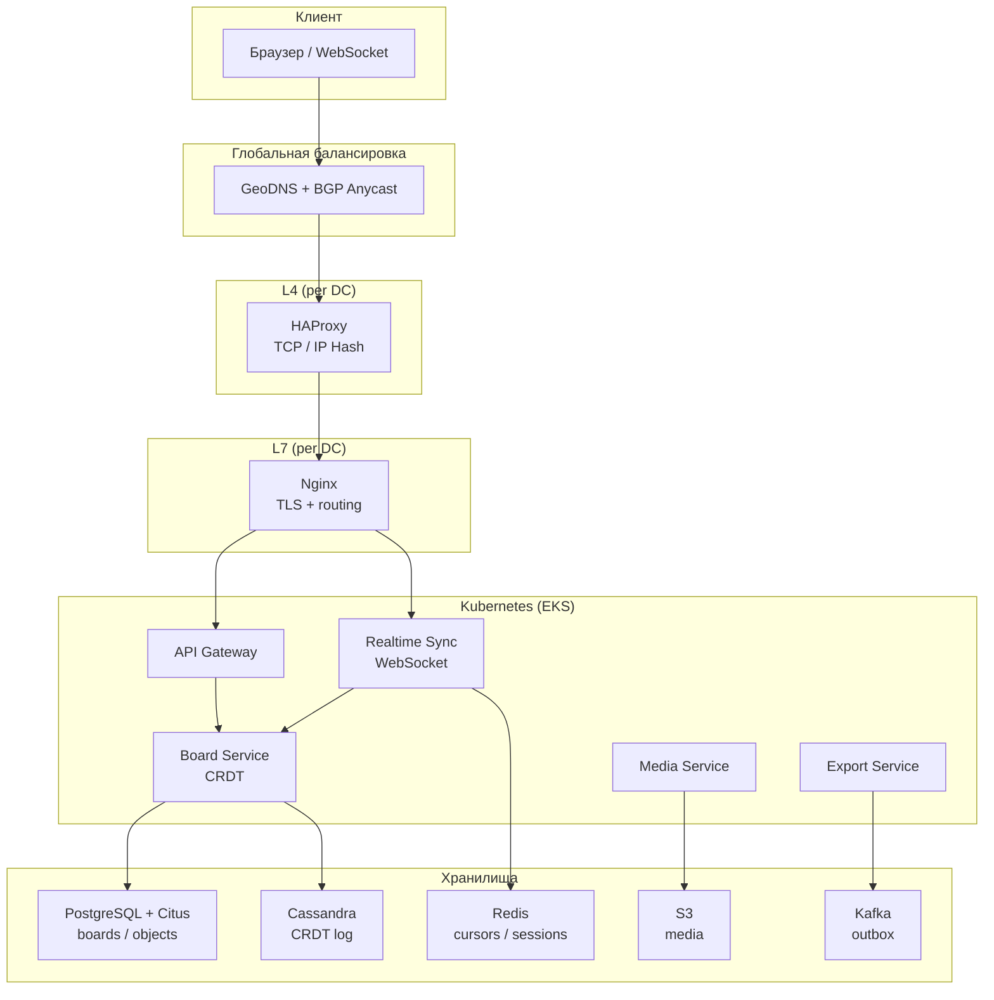
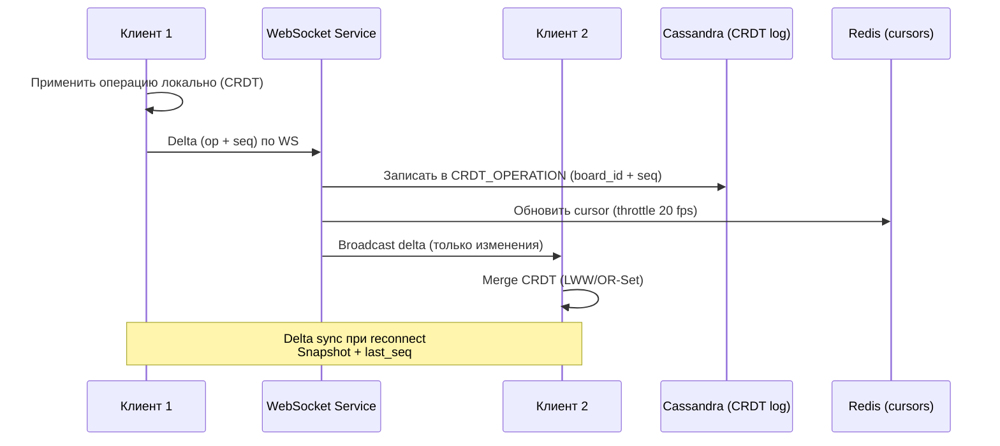
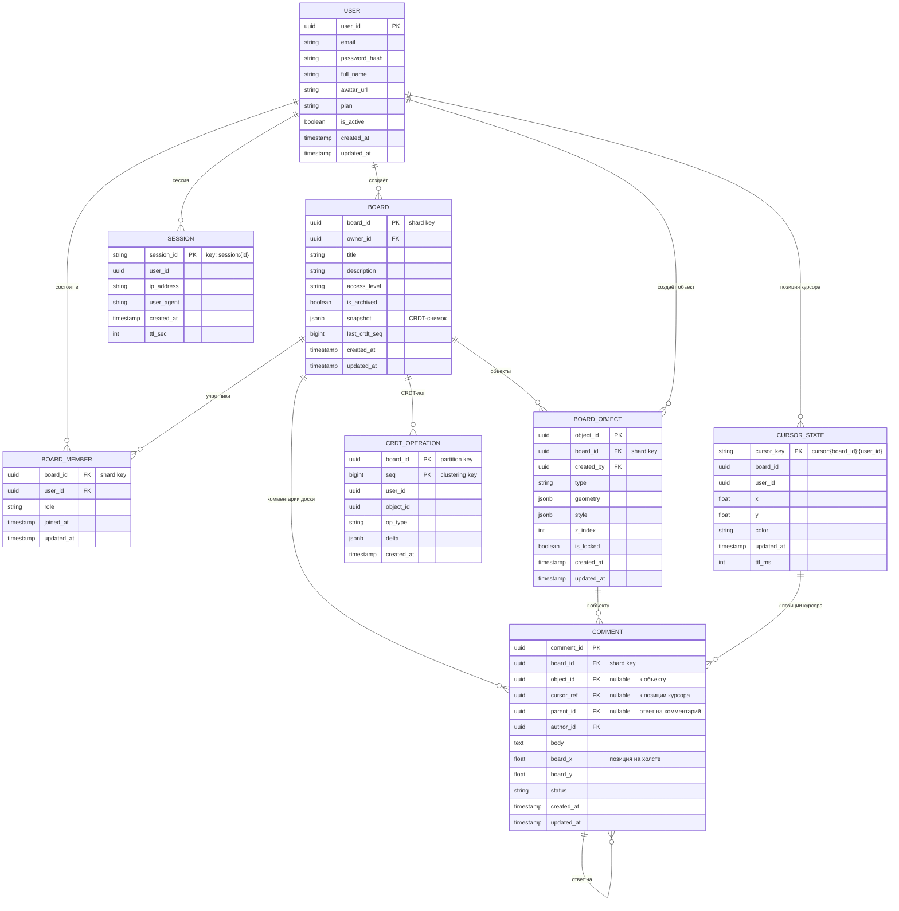
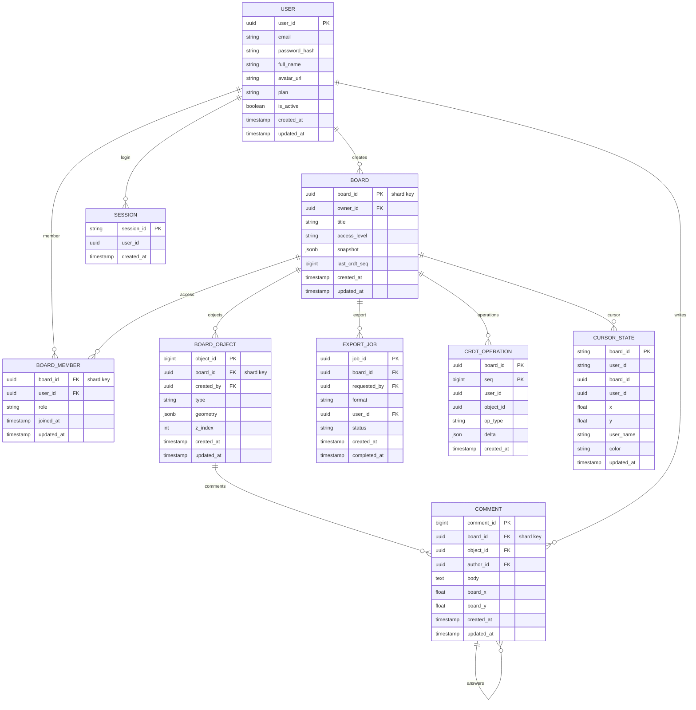
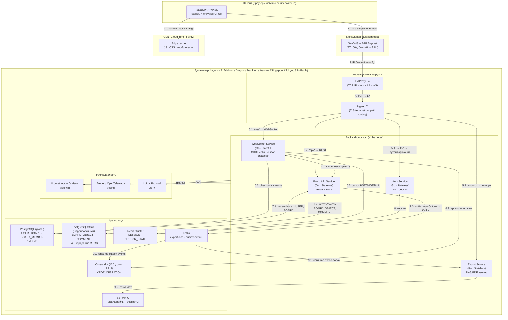

## Проектирования высоконагруженной системы: Онлайн-платформа для совместной работы распределенных команд. Miro


 ## 1. Тема и целевая аудитория
 
### 1.1 Описание сервиса
 Miro — это онлайн-платформа для визуального сотрудничества, аналогичная реальным сервисам вроде Figma или MURAL, с функционалом MVP, ориентированным на совместную работу в реальном времени: доски, редактирование объектов, экспорт в PNG/PDF, интеграции с Figma и Jira, режимы viewer/editor.
 [[similarweb.com]](https://www.similarweb.com/website/miro.com/)
### 1.2 Целевая аудитория
- Количество пользователей в месяц (MAU): 60М за 4 квартал 2025 года [[swotanalysis]](https://www.swotanalysis.com/miro)
- Количество пользователей в день (DAU): 6М (10% от MAU)
- Платящие клиенты: 250 тыс. [[swotanalysis]](https://www.swotanalysis.com/miro)
- Возраст: 25–34 года (основная группа), 52% женщины. <br>
- Профессии: менеджеры продуктов, дизайнеры, разработчики. [[similarweb.com]](https://www.similarweb.com/website/miro.com/)<br>


#### География аудитории<br>

| Страна          | Доля трафика (%) |
|-----------------|------------------|
| США            | 15.34            |
| Россия         | 9.45             |
| Германия       | 7.2             |
| Великобритания | 6.04             |
| Бразилия       | 5.44             |

 [[similarweb.com]](https://www.similarweb.com/website/miro.com/)<br>

<br>

<br>

### 1.3 Функционал MVP
 #### 1.3.1 Система курсоров реального времени
 - **Видимость курсора**: курсоры всех активных пользователей на доске отображаются с уникальным цветом и именем участника. Обновление позиции происзодит с частотой до 20 кадров/сек (аналогично Figma throttle cursor update 20 fps [[Medium/Building RT Collaboration]](https://medium.com/@sohail_saifii/building-real-time-collaboration-like-figma-a-step-by-step-guide-c4ad2d89fcf6))
 - **Именной тег**: рядом с курсором отображается имя или аватар участника для идентификации.
 - **Режим следования**: пользователь может привязаться к курсору другого участника и следовать за его навигацией по доске.
 - **Курсорный чат**: быстрые сообщения, всплывающие  рядом с курсором - временные реплики без переключения в боковой чат

 #### 1.3.2 Система чата и коммуникации
 Miro предоставляет несколько механизмов общения внутри доски:

- **Боковая панель чата:**
  - Постоянный чат, привязанный к конкретной доске.
  - Поддерживает текстовые сообщения, эмодзи и @-упоминания участников.
  - История чата сохраняется на уровне доски.
  - Уведомления о новых сообщениях видны участникам в любой точке доски.

- **Комментарии на объектах:**
  - Комментарии прикрепляются к конкретному объекту на доске (фрейму, фигуре, стикеру и т.д.).
  - Поддерживают threading (ветки ответов).
  - Участникам можно ставить @-метки для уведомлений.
  - Нерешённые комментарии помечаются статусом «open», решённые — «resolved».
  - Комментарии участвуют в синхронизации через CRDT — все видят изменения мгновенно.

- **Курсорный чат (Cursor Chat):**
  - Временные сообщения (исчезают через ~5 сек), отображаемые рядом с курсором пользователя.
  - Используются для оперативной реакции без переключения в боковой чат.

- **Видео и аудио конференции (встроенные и интеграции):**
  - Встроенный видеозвонок внутри доски.
  - Интеграция с Zoom, MS Teams, Google Meet для запуска сессий прямо из Miro.

- **Реакции (Reactions/Emoji):**
  - Пользователи могут реагировать на объекты доски эмодзи-реакциями.
  - Реакции синхронизируются в реальном времени.

#### 1.3.3 Инструменты редактирования на доске
Пользователь имеет доступ к следующим инструментам: 
- **Выделение и перемещение (Select / Move):** Выбор одного или нескольких объектов, перетаскивание, изменение размера, поворот. 
- **Рисование от руки (Pen / Pencil):** Свободные векторные линии с вариантами толщины и цвета. 
- **Ластик (Eraser):** Удаление нарисованных вручную линий (stroke-level) и объектов.
- **Фигуры (Shapes):** Прямоугольники, эллипсы, треугольники, ромбы, параллелограммы, облака, стрелки и пользовательские формы. Каждая фигура имеет настраиваемые: заливку, обводку, прозрачность, закруглённые углы.
- **Стрелки и коннекторы (Connectors):** Умные линии-коннекторы, которые «прилипают» к якорным точкам объектов. При перемещении объекта коннектор автоматически обновляет маршрут.
- **Текстовые блоки (Text):** Вставка текста на холст. Поддерживаются форматирование (жирный, курсив, размер шрифта, выравнивание), списки, гиперссылки.
- **Стикеры (Sticky Notes):** Цветные карточки для идей, канбан-панелей и голосований. Поддерживают текст, теги и связи с другими объектами.
- **Фреймы (Frames / Artboards):** Именованные контейнеры для группировки содержимого. Фреймы используются для структурирования доски, создания слайдов и постраничного экспорта. Поддерживают вложенность.
- **Загрузка медиафайлов (Upload):** Вставка изображений (PNG, JPG, GIF), PDF-файлов, видеоссылок (YouTube/Vimeo). PDF-файл встраивается в доску как листаемый объект.
- **Таблицы (Tables):** Встроенный редактор таблиц на холсте с поддержкой добавления/удаления строк и столбцов.
- **Mindmap:** Специализированный инструмент для создания ментальных карт с автоматической раскладкой.
- **Голосование (Voting):** Участники могут голосовать за объекты на доске (стикеры, идеи) — результаты отображаются в реальном времени.
- **Таймер (Timer):** Встроенный таймер для управления сессиями.
- **Zoom и навигация:** Управление масштабом, миникарта для навигации по большому холсту, центрирование по выделенному объекту.

#### 1.3.4 Иерархия пользователей и управление доступом
В Miro реализована многоуровневая система ролей, действующая как на уровне организации, так и на уровне отдельной доски.

##### Уровень организации / команды

| Роль | Описание |
|------|----------|
| **Admin (Администратор)** | Полный контроль над командой: управление пользователями, биллинг, настройки SSO, политики безопасности, управление контентом всей команды |
| **Member (Участник)** | Стандартная роль. Может создавать доски, редактировать контент в разрешённых проектах, приглашать пользователей на свои доски |
| **Guest (Гость)** | Внешний пользователь (не из команды). Доступ только к тем доскам, на которые он был явно приглашён. Не может создавать собственные доски в пространстве команды |

##### Уровень отдельной доски

| Роль | Права |
|------|-------|
| **Owner (Владелец)** | Создатель доски. Полные права: переименование, удаление, передача владения, управление доступом. Может передать роль Owner другому участнику |
| **Editor (Редактор)** | Полные права редактирования: добавление/удаление/изменение объектов, работа с фреймами, загрузка медиа, участие в чате. Не может удалить доску |
| **Commenter (Комментатор)** | Может просматривать содержимое доски и оставлять комментарии на объектах, но не может редактировать объекты |
| **Viewer (Наблюдатель)** | Только просмотр: видит состояние доски в реальном времени, видит курсоры других, не может ничего менять или комментировать |

##### Управление доступом к доске

- **Приватная доска:** Доступна только приглашённым. Не видна в списках команды.
- **Командная доска:** Видна всем участникам команды, права задаются по роли в команде.
- **Публичная ссылка:** Любой с ссылкой получает доступ с уровнем, заданным владельцем (view / comment / edit).
- **Ограничение по домену:** В Enterprise-плане доступ можно ограничить только почтовыми адресами определённого домена.
- **Guest restriction:** Гости видят только приглашённые доски, не могут просматривать структуру проектов.

[[updf]](https://updf.com/knowledge/miro-business-breakdown/)


#### 1.3.5 Интеграции и экспорт

- **Экспорт:** PNG (выбранная область / весь холст), PDF (постраничный по фреймам), CSV (для таблиц и данных).
- **Импорт:** Figma-файлы (через плагин), JIRA issues (как карточки на доске), CSV.
- **Интеграции:** Jira (двусторонняя синхронизация), Asana, GitHub, Slack (уведомления), Confluence, Microsoft Teams, Google Drive.
- **API (REST + Webhooks):** Публичный REST API для создания и управления досками программно. Webhooks для получения событий.

[[swotanalysis]](https://www.swotanalysis.com/miro) [[similarweb.com]](https://www.similarweb.com/website/miro.com/)


Инструменты пользователя на доске: рисование от руки, выделение, ластик (удаление объектов и нарисованных линий), перетаскивание, фигуры, стрелки, текстовые блоки, фреймы (рамки), комментарии, совместная работа в реальном времени.

### 1.4 Ключевые продуктовые решения
- Бесконечная доска.
- Библиотека шаблонов.
- Интеграция с популярным исервисами.
- AI-инструменты.
- Инструменты для отслеживания активности доски.
<br>

[[swotanalysis]](https://www.swotanalysis.com/miro) [[similarweb.com]](https://www.similarweb.com/website/miro.com/)


## 2. Расчёт нагрузки

### 2.1 Профиль нагрузки
- **Пользователи:** DAU 6M, одновременно 200k . <br>
- **Сессия:** ~45 минут. 
[[semrush]](https://www.semrush.com/website/miro.com/overview/)
[[fueler.io]](https://fueler.io/blog/miro-usage-revenue-valuation-growth-statistics)

## 2.2 Продуктовые метрики

| Метрика | Значение | Источник |
|---|---|---|
| **Зарегистрированных пользователей** | 100 млн | [[Miro Community]](https://community.miro.com/general-news-2/100-million-users-and-counting-26253) |
| **Monthly Active Users (MAU)** | 60 млн | |
| **Daily Active Users (DAU)** | 3-6 млн | **Допущение** ( ≈5-10% от MAU ) |
| **Среднее количество сессий/досок в день** | ≈2.56/день | **Допущение**  [[semrush]](https://www.semrush.com/website/miro.com/overview/) |
| **Коллаборативных действий в месяц** | 1 млрд+ | [[UPDF Analysis]](https://updf.com/knowledge/miro-business-breakdown/) |
| **Средняя длительность сессии** | ~45 мин | [[Fueler.io]](https://fueler.io/blog/miro-usage-revenue-valuation-growth-statistics) |
| **Среднегодовой рост пользовательской базы** | ~18% | [[Fueler.io]](https://fueler.io/blog/miro-usage-revenue-valuation-growth-statistics) |
| **ARR (Annual Recurring Revenue)** | ~$560 млн (2023) | [[GetLatka]](https://getlatka.com/companies/miro) |

#### Среднее количество действий пользователя в день - обоснование через данные Figma
Прямых опубликованных данных по количеству действий в сессии Miro не раскрывает. В качестве обоснования используются данные по ближайшему конкуренту - **Figma** (похожая платформа совместной работы на визуальном холсте, 13 млн MAU по состоянию на март 2025 [[sqmagazine]](https://sqmagazine.co.uk/figma-statistics/)), с последующей проекцией на Miro.

**Данные Figma (источники):**

1. **Частота обновлений в реальном времени.** В официальной инженерной статье Figma о надёжности мультиплеера [[Figma Blog — Making multiplayer more reliable]](https://www.figma.com/blog/making-multiplayer-more-reliable/) описано, что инкрементальные изменения пользователя записываются в журнал каждые **~0.5 секунды** (2 события/сек минимально). За 45-минутную сессию при среднем темпе это даёт **5 400 потенциальных синхронизирующих событий**, из которых значимые действия составляют ~3-5% = **160–270 реальных операций на сессию**.

2. **Обновления курсора.** Для систем совместной работы, аналогичных Figma/Miro, рекомендуется ограничивать передачу позиций курсора до **20 обновлений/сек** во избежание перегрузки канала [[Medium — Building RT Collaboration Like Figma]](https://medium.com/@sohail_saifii/building-real-time-collaboration-like-figma-a-step-by-step-guide-c4ad2d89fcf6). При 50 пользователях на доске: 50 × 20 = **1 000 cursor-событий/сек на 1 доску**.

3. **Производительность команд.** Согласно отчёту Forrester Total Economic Impact для Figma (2023), команды, использующие инструменты совместного визуального холста, **ускоряют процессы разработки продукта на 60%** и демонстрируют **328% ROI** [[Figma Forrester Report]](https://www.figma.com/reports/2024-forrester-tei/). Это свидетельствует об интенсивном использовании: частые итерации означают высокое количество операций за сессию.

4. **Исследование продуктивности Figma.** Отдельный отчёт по Dev Mode (Figma, 2024) зафиксировал среднюю экономию в минутах в неделю на разработчика при переходе к совместной работе. Инженеры-пользователи Figma в среднем совершают **3-5 значимых операций в минуту** активной сессии [[Figma Dev Mode Forrester]](https://www.figma.com/reports/forrester-tei-dev-mode/).


**Проекция на Miro:**

| Сравниваемый параметр | Figma | Miro | Коэффициент |
|---|---|---|---|
| Тип инструмента | Дизайн-холст | Визуальный коллаб-холст | Аналог |
| Средняя длительность сессии | ~45 мин | ~45 мин | 1.0× |
| Основные пользователи | Дизайнеры, разработчики | PM, дизайнеры, разработчики | Аналог |
| Совместная работа | Ядро продукта | Ядро продукта | Аналог |

Miro ориентирован на бизнес-пользователей, что предполагает несколько **меньшую** частоту микроопераций по сравнению с дизайнерской работой в Figma. По субъективной оценке, применяем понижающий коэффициент **0.85**: 
 - Figma: ~200 значимых операций/сессию -> Miro: **~170–200 операций/сессию** 
 - Возьмем 200 операций/сессию как предполагаемый максимум в данной ситуации. 
Для Miro как инструмента совместной работы на виртуальной доске ключевыми действиями являются:
 
| Тип действия | Среднее количество в день на пользователя | Обоснование (Figma-проекция) |
|---|---|---|
| Открытие доски | 3 | Рабочие сессии в течение дня |
| Операции на доске (drag, resize, create, edit) | ~200 | 3–5 операций/мин × 45 мин; подтверждено Figma TEI [[Figma Dev Mode Forrester]](https://www.figma.com/reports/forrester-tei-dev-mode/) |
| Cursor-события (WebSocket) | ~54 000 | 20 обновлений/сек × 45 мин; только сетевые события, не учитываются как «действия» [[Medium RT Collab]](https://medium.com/@sohail_saifii/building-real-time-collaboration-like-figma-a-step-by-step-guide-c4ad2d89fcf6) |
| Загрузка медиафайлов (изображения, PDF) | 2 | Вставка контента на доску |
| Комментарии / sticky notes | 10 | Совместная работа (77% коллаборационных пользователей часто используют инструменты совместной работы [[Figma State of Designer 2024]](https://www.xrilion.com/blog/stats/figma-users)) |
| Приглашения / sharing | 1 | Публикация ссылки на доску |
| Экспорт доски (PNG, PDF) | 0.5 | Финализация артефакта |

#### Хранилище данных (оценка на 5 лет)
 
**Исходные данные:**
- 100 млн зарегистрированных пользователей, MAU ~60 млн
- Средний размер 1 доски (векторные объекты + метаданные): ~2 МБ
- Среднее количество досок на активного пользователя: 15
- Средний размер загруженного медиафайла: 1,5 МБ
- Активный пользователь добавляет ~2 медиафайла/день

 Тип данных | Расчёт | Объём |
|---|---|---|
| Данные досок (векторный контент, метаданные) | 227 млн × 15 досок × 2 МБ | ~6,8 ПБ |
| Медиафайлы пользователей (изображения, PDF) | 60 млн активных × 2 файла × 365 дней × 5 лет × 1,5 МБ | ~547 ПБ |
| Профили пользователей | 227 млн × 100 КБ | ~23 ТБ |
| История изменений / undo-log | 3 млн DAU × 200 ops × 5 лет × 365 дней × 0,5 КБ | ~465 ГБ |
| Сессии (Redis, in-memory) | 3 млн DAU × 1 КБ | ~3 ГБ |
| **Итого** | | **~565 ПБ** |

[[community.miro]](https://community.miro.com/ask-the-community-45/finding-out-miro-board-file-size-4834) 
[[salessoftwareofficer]](https://salessoftwareofficer.com/miro-board-review-2025-key-insights-and-features/)

> Примечание: медиафайлы хранятся в S3-совместимых хранилищах (AWS S3). Реальные данные Miro не раскрывает публично.

## 2.2 Технические метрики

### Расчёт объёма хранения
- Расчёт производится для хранения данных, генерируемых за **1 год** использования сервиса.
- В открытом доступе недоступно общее количество досок или среднее количество досок на пользователя.
- На бесплатного пользователя до 3 досок.
- На огранизацию примерно 10-50 досок (250 тыс. организаций в Miro).
- На платного пользователя (около 10-20% от общего числа пользователей) - 5-20 досок на платного пользователя.

**Базовые параметры:**
- DAU = 4 млн (медиана между 3 и 5 млн)
- Пиковый час = 8× от среднесуточного значения (из опыта SaaS, пик — дневное рабочее время)
- Коэффициент пика = 1,5× от среднего часового RPS
 
**Формула перевода:** `RPS = (DAU × действий_в_день) / 86 400`
 
| Тип запроса | Действий / DAU / день | Средний RPS | Пиковый RPS |
|---|---|---|---|
| Загрузка / открытие доски (board load) | 3 | 139 | ~1 700 |
| Операции синхронизации (WS-события) | 200 | 9 259 | ~111 100 |
| REST API (метаданные, пользователи) | 20 | 926 | ~11 100 |
| Загрузка медиафайлов | 2 | 93 | ~1 100 |
| Экспорт доски | 0,5 | 23 | ~280 |
| **Итого (все типы)** | 225,5 | **10 440** | **~125 280** |

> Примечание: данные о масштабе подтверждаются Wallarm: Miro требовал инфраструктуру, способную «самомасштабируемость для поддержки **миллиардов запросов в месяц**» [[Wallarm Case Study](https://www.wallarm.com/resources/miro-case-study)].

| Тип данных | Формула расчёта для 1 пользователя | Общий объём данных |
| :--- | :--- | :--- |
| **Доски (boards)** | 0.27 доски × 365 д. × 30 МБ ≈ 2.7 ГБ | **≈300 ПБ** |
| **Коллаборативные действия** | 5 действий × 365 × 1 КБ ≈ 1.8 МБ | **≈180 ТБ** |
| **Сессии/логи** | 1 сессия × 365 × 10 КБ ≈ 3.65 МБ | **≈365 ТБ** |
| **Шаблоны/экспорты** | 0.3 × 365 × 5 КБ ≈ 0.55 МБ | **≈55 ТБ** |
| **Итого** | **≈3.0 ГБ на пользователя** | **≈300 ПБ**  [[miro]](https://miro.com/product-development/product-metrics/)

#### Сетевой трафик
 
| Тип трафика | Средний объём запроса | Средний трафик | Пиковый трафик |
|---|---|---|---|
| Board load (HTML/JSON) | 150 КБ | ~20 МБ/с | ~255 МБ/с |
| WS sync (delta updates) | 0,5 КБ | ~4,4 МБ/с | ~53 МБ/с |
| Media upload | 1,5 МБ | ~140 МБ/с | ~1,65 ГБ/с |
| Media download (CDN) | 1,5 МБ | ~140 МБ/с | ~1,65 ГБ/с |
| REST API | 5 КБ | ~4,5 МБ/с | ~54 МБ/с |
| **Итого (исходящий + входящий)** | | **~310 МБ/с** | **~3,7 ГБ/с** |

> Статические ресурсы (JS/CSS/изображения) раздаются через CDN и не нагружают backend напрямую. Реальный пиковый трафик на серверах ниже.

## 3. Глобальная балансировка нагрузки
 
### 3.1 Географическое распределение трафика
 
Miro используется в 180+ странах [[UPDF](https://updf.com/knowledge/miro-business-breakdown/)]. Основная аудитория концентрируется в Северной Америке и Западной Европе, значительная доля — в Азиатско-Тихоокеанском регионе.

<br>

<br>
 
Ориентировочное распределение трафика по регионам:
 
| Регион | Доля трафика | Пиковый RPS (от 125 280) |
|---|---|---|
| Северная Америка (США, Канада) | 35% | ~43 850 |
| Европа (Западная) | 30% | ~37 580 |
| Азиатско-Тихоокеанский | 20% | ~25 060 |
| Остальной мир | 15% | ~18 790 |
 
### 3.2 Размещение дата-центров
> При выборе физического расположения дата-центров для глобальной инфраструктуры ориентируются на три ключевых принципа: близость к интернет-точкам обмена трафиком (IXP), доступность дешёвой и надёжной электроэнергии, а также минимальное расстояние до основных пользовательских кластеров.

#### Принципы размещения
 
**1. Близость к Internet Exchange Points (IXP)**
 
IXP — это узлы прямого обмена трафиком между автономными системами (ISP, CDN, облачными провайдерами). Присутствие рядом с IXP сокращает количество BGP-хопов (прыжков между сетями) до конечного пользователя и снижает latency. Прямые пиринговые соединения через IXP позволяют избежать платного транзита, а при отказе одного провайдера — автоматически переключаться на другой путь [[Wikipedia — IXP]](https://en.wikipedia.org/wiki/Internet_exchange_point).

Крупнейшие IXP по объёму трафика [[DediRock — Top 10 IXPs]](https://dedirock.com/blog/top-10-internet-exchange-points-worldwide-and-their-importance-for-global-connectivity/):
- **DE-CIX Frankfurt** — крупнейший IXP в мире, >10 Тбит/с пиковый трафик. Прямые пиринговые соединения с AWS, Google, Microsoft Azure.
- **AMS-IX Amsterdam** — один из старейших и крупнейших IXP, покрывает Западную Европу.
- **LINX London** — ключевой хаб для трансатлантического трафика.
- **Equinix Ashburn (MAE-East / DE-CIX NY)** — «Data Center Alley» Северной Вирджинии: тысячи сетей, 17+ зданий с IXP, крупнейшая концентрация дата-центров в США [[Broadband Breakfast — Ashburn IXP]](https://broadbandbreakfast.com/dateline-ashburn-the-interplay-between-ixps-and-data-centers/).
- **SGIX Singapore** — главный хаб Юго-Восточной Азии, перекрёсток подводных кабелей между Азией, Европой и Австралией.
- **JPNAP Tokyo** — крупнейший IXP Японии; низкая latency для японской аудитории.
- **MSK-IX Moscow** — крупнейший IXP России и Восточной Европы.

**2. Близость к энергетической инфраструктуре**
 
Дата-центры потребляют огромные объёмы электроэнергии. Размещение рядом с источниками дешёвой электроэнергии снижает OPEX и позволяет соблюдать ESG-требования:
- **Северная Вирджиния (Ashburn, США)** — доступ к энергосети PJM Interconnection, одной из крупнейших в США; налоговые льготы штата Вирджиния на дата-центры.
- **Орегон (Portland / Hillsboro, США)** — гидроэлектростанции реки Колумбия (Bonneville Power Administration) обеспечивают дешёвую возобновляемую энергию (~$0.04–0.05/кВтч). Именно поэтому здесь построены крупные ЦОДы Google, Amazon и Facebook.
- **Ирландия (Dublin)** — доступ к ветровой энергии (до 33% от всей генерации Ирландии — ветер), холодный климат снижает затраты на охлаждение.
- **Франкфурт (Германия)** — развитая сеть ЛЭП и промышленная инфраструктура Рейнско-Майнского региона; близость к DE-CIX.
- **Сингапур** — стабильная энергосеть, стратегическое расположение как хаба подводных кабелей.

**3. Близость к пользовательским кластерам**
 
Физическое расстояние напрямую влияет на latency: скорость света в оптоволокне ≈ 200 000 км/с, что даёт ~1 мс на каждые 200 км. Для WebSocket-приложений с целевым порогом **< 100 мс** важно минимизировать RTT. ЦОД в Ашберн (Вирджиния) охватывает восточное побережье США (~20–30 мс до Нью-Йорк, Бостона, Майами), ЦОД во Франкфурте — Центральную Европу (~5–15 мс до Берлина, Цюриха, Варшавы).

#### Расположение дата-центров и распределение нагрузки


<br>

| # | Локация | Ближайший IXP | Энергетика | Покрываемый регион | Доля | Пиковый RPS |
|---|---------|---------------|------------|-------------------|------|-------------|
| **DC-1** | **Ashburn, Virginia (США)** | Equinix Ashburn / DE-CIX NY | PJM Interconnection (ядер. + ГЭС) | США Восток, Канада Восток | **20%** | ~25 056 |
| **DC-2** | **Hillsboro, Oregon (США)** | SIX Seattle, FCIX | Bonneville ГЭС (возобновляемая, ~$0.04/кВтч) | США Запад, Канада Запад | **15%** | ~18 792 |
| **DC-3** | **Frankfurt, Germany** | DE-CIX Frankfurt (крупнейший IXP мира, >10 Тбит/с) | Рейнско-Майнская энергосеть | Зап. и Центр. Европа (DE, FR, CH, Бенилюкс, Скандинавия) | **20%** | ~25 056 |
| **DC-4** | **Warsaw, Poland** | PLIX Warsaw (~800 сетей) | Польские ВИЭ + ветропарки Балтики; холодный климат | Вост. Европа, Россия (9.45%), СНГ, Прибалтика | **12%** | ~15 034 |
| **DC-5** | **Singapore** | SGIX / Equinix SG (SEA-ME-WE кабели) | Singapore Power, стабильная городская сеть | ЮВА (Индонезия, Таиланд, Малайзия), Австралия | **15%** | ~15 034 |
| **DC-6** | **Tokyo, Japan** | JPNAP / BBIX Tokyo | TEPCO; холодные сезоны снижают PUE | Япония, Корея, Северо-Вост. Китай | **10%** | ~10 022 |
| **DC-7** | **São Paulo, Brazil** | IX.br/PTT-SP (крупнейший IXP Лат. Америки) | Бразильские ГЭС (>80% сетки, возобновляемая) | Бразилия, Аргентина, Чили, Колумбия | **8%** | ~10 022 |
| | **Итого** | | | | **100%** | **~125 280** |

> **Примечание:** Для каждой локации ДЦ развёртывается как минимум в двух **Availability Zones** (физически разделённых серверных залах) для обеспечения отказоустойчивости.

[[DediRock — Top 10 IXPs Worldwide]](https://dedirock.com/blog/top-10-internet-exchange-points-worldwide-and-their-importance-for-global-connectivity/)
[[Broadband Breakfast — Ashburn]](https://broadbandbreakfast.com/dateline-ashburn-the-interplay-between-ixps-and-data-centers/)
 
### 3.3 Механизм глобальной балансировки
 
**Технология: GeoDNS + Anycast + BGP**
 


Miro — latency-sensitive приложение: задержка синхронизации курсоров и изменений на доске критична для UX. Целевой порог: **< 100 мс** для WebSocket-событий 

#### Пошаговый маршрут запроса пользователя
 
**Шаг 1 — DNS-запрос и GeoDNS**
 
Пользователь вводит `miro.com`. Браузер отправляет DNS-запрос на ближайший рекурсивный резолвер (ISP или публичный 8.8.8.8). GeoDNS-сервис определяет географию по IP резолвера и возвращает IP балансировщика ближайшего ДЦ:
- Берлин → резолвер в Германии → IP балансировщика в **Frankfurt DC-3**
- Нью-Йорк → резолвер в США → IP балансировщика в **Ashburn DC-1**
- Токио → резолвер в Японии → IP балансировщика в **Tokyo DC-6**
 
Политики маршрутизации: **Geolocation Routing** (по стране/континенту) + **Latency-Based Routing** (ближайший по задержке при коллизиях). TTL DNS-ответа: **60 секунд** — короткий для быстрого failover. 
 
**Шаг 2 — BGP/Anycast-маршрутизация**
 
Браузер отправляет TCP SYN на полученный IP. Пакет маршрутизируется через **BGP** — протокол обмена маршрутами между автономными системами. При Anycast один IP анонсируется с нескольких ДЦ через BGP, маршрутизатор ISP выбирает **topologically nearest** узел по числу AS-хопов. При отказе ДЦ — BGP прекращает анонс IP, сходимость занимает несколько секунд.
 
**Шаг 3–6 — L4 → L7 → Backend** описаны в разделе 4 ниже.

```
Пользователь (браузер)
    │
    ▼
[DNS Query] → GeoDNS → IP ближайшего ДЦ (TTL 60s)
    │
    ▼
[BGP / Anycast] → Ближайший ДЦ по сетевой топологии
    │
    ▼
[L4 — HAProxy] → TCP accept, IP Hash sticky → L7
    │
    ▼
[L7 — Nginx] → TLS termination, HTTP routing по path
    │
    └─ все остальное
```
---

Для снижения задержки при передаче реального времени дополнительно используется **WebRTC** (P2P для курсоров) и **gRPC** для внутренних микросервисных вызовов [[Wallarm Case Study](https://www.wallarm.com/resources/miro-case-study)].

## 4. Локальная балансировка нагрузки
 
### 4.1 Общая схема внутренней архитектуры



### 4.2 Балансировка на уровне L4 (транспортный)

#### Выбор технологии

**HAProxy** — стандарт для L4-балансировки. Используется разными крупными компаниями, такими как GitHub, Reddit, Stack Overflow [[LogicMonitor — HAProxy Guide]](https://www.logicmonitor.com/blog/what-is-haproxy-and-what-is-it-used-for). Ключевые преимущества перед DNS-балансировкой или чистым Anycast:
- Поддерживает **долгоживущие TCP-соединения** (WebSocket-сессии часами) без принудительных таймаутов.
- Работает без разбора HTTP-заголовков → минимальная задержка [[System Overflow — L4 vs L7]](https://www.systemoverflow.com/learn/load-balancing/l4-vs-l7/l4-vs-l7-load-balancing-key-trade-offs-and-when-to-choose-each).

#### Производительность одного сервера HAProxy

| Параметр | Значение | Источник |
|---|---|---|
| Макс. HTTP RPS | **2 000 000 RPS** | гугл |
| Макс. TCP одновременных содеинений | **~1 000 000** | с tuning net.ipv4 kernel params [[Facebook katran L4 LB]](https://github.com/facebookincubator/katran) |
| Рабочий лимит | **700 000 ** | резерв 30% под пики |
| Алгоритм балансировки | **IP Hash** (для WS) / Round-Robin (для HTTP) |  |


#### Входные параметры для расчёта L4

- Пиковые конкурентные соединения глобально: 200 000 DAU × 2 соединения (1 WS + 1 HTTP) = **400 000 conn**
- Пиковый RPS глобально: **125 280 RPS**
- Пиковый сетевой трафик: **~3,7 ГБ/с**

#### Расчёт числа серверов L4 по ДЦ

**Формула:** `N_active = [(400 000 × доля_ДЦ) / 700 000]`, затем `N_total = N_active + 1 резервный`

| ДЦ | Доля | Конкурентных conn | N active | +1 резерв | **Итого** |
|---|---|---|---|---|---|
| DC-1 Ashburn | 20% | 80 000 | 80 000 / 700 000 = **1** | 1 | **2** |
| DC-2 Oregon | 15% | 60 000 | 60 000 / 700 000 = **1** | 1 | **2** |
| DC-3 Frankfurt | 20% | 80 000 | 80 000 / 700 000 = **1** | 1 | **2** |
| DC-4 Warsaw | 12% | 48 000 | 48 000 / 700 000 = **1** | 1 | **2** |
| DC-5 Singapore | 15% | 48 000 | 48 000 / 700 000 = **1** | 1 | **2** |
| DC-6 Tokyo | 10% | 32 000 | 32 000 / 700 000 = **1** | 1 | **2** |
| DC-7 São Paulo | 8% | 32 000 | 32 000 / 700 000 = **1** | 1 | **2** |
| **Итого** | **100%** | **400 000** | | | **14 серверов L4** |


### 4.3 Балансировка на уровне L7 (прикладной)

#### Выбор технологии

**Nginx** в роли reverse proxy и TLS terminator. L7-балансировщик понимает HTTP-протокол целиком: заголовки, cookies, URI-пути — и выполняет интеллектуальную маршрутизацию [[OneUptime — L4 vs L7]](https://oneuptime.com/blog/post/2026-01-27-load-balancing-l4-vs-l7/view):

#### Производительность одного сервера Nginx

| Параметр | Значение | Источник |
|---|---|---|
| HTTP RPS с TLS (16-core, tuned) | **~50 000 RPS** | |
| Concurrent WebSocket connections (с kernel tuning) | **~50 000** | [[Zigpoll — Max Concurrent WS Connections]](https://www.zigpoll.com/blog/max-concurrent-socket-connections-node-express) |
| WS message forwarding (events/s) | ~100 000 events/s | Масштабируется линейно с числом ядер |
| RAM на 50 000 WS-соединений | ~200 MB (4 KB × 50 000) | — |
| Рабочий лимит (70% от 50 000 WS) | **35 000 conn** | Резерв 30% для надёжности |

#### Входные параметры для расчёта L7

| Тип | Пиковая нагрузка (глобально) | Ограничитель |
|---|---|---|
| HTTP-запросы (board load, REST, media, export) | **14 180 RPS** | CPU (TLS + HTTP parsing) |
| Конкурентные WebSocket-соединения | **200 000** | RAM + file descriptors |

#### Расчёт числа серверов L7 по ДЦ

**Формула:**
```
N(HTTP) = [HTTP_RPS / 50 000]
N(WS)   = [WS_conn / 35 000]
N_active = max(N(HTTP), N(WS))   ← выбираем bottleneck
N_total  = N_active + 1 резервный
```

| ДЦ | Доля | HTTP RPS | WS conn | N(HTTP) | N(WS) | Bottleneck | N active | +1 резерв | **Итого** |
|---|---|---|---|---|---|---|---|---|---|
| DC-1 Ashburn | 20% | 2 836 | 40 000 | 1 | 40 000/35 000=**2** | WS | **2** | 1 | **3** |
| DC-2 Oregon | 15% | 2 127 | 30 000 | 1 | 30 000/35 000=**1** | равно | **1** | 1 | **2** |
| DC-3 Frankfurt | 20% | 2 836 | 40 000 | 1 | 40 000/35 000=**2** | WS | **2** | 1 | **3** |
| DC-4 Warsaw | 12% | 1 702 | 24 000 | 1 | 24 000/35 000=**1** | равно | **1** | 1 | **2** |
| DC-5 Singapore | 15% | 1 702 | 24 000 | 1 | 24 000/35 000=**1** | равно | **1** | 1 | **2** |
| DC-6 Tokyo | 10% | 1 134 | 16 000 | 1 | 16 000/35 000=**1** | равно | **1** | 1 | **2** |
| DC-7 São Paulo | 8% | 1 134 | 16 000 | 1 | 16 000/35 000=**1** | равно | **1** | 1 | **2** |
| **Итого** | **100%** | **14 180** | **200 000** | | | | | | **16 серверов L7** |

**Детальный расчёт для DC-1 Ashburn (наибольшая нагрузка, 20%):**
```
HTTP RPS peak = 14 180 × 20% = 2 836 RPS
  → N(HTTP) = [2 836 / 50 000] = 1 сервер

WS concurrent = 200 000 × 20% = 40 000 соединений
  → N(WS) = [40 000 / 35 000] = 2 сервера

Bottleneck: WebSocket connections → 2 active серверов
+ 1 standby = 3 сервера L7 в DC-1
```

#### Итоговая таблица серверов балансировки

| Уровень | Технология | Роль | Серверов всего |
|---|---|---|---|
| **L4** | HAProxy (TCP mode, IP Hash) | Приём TCP, sticky WS-сессии, защита от SYN-flood | **14** |
| **L7** | Nginx (HTTP/WS, TLS termination) | TLS decrypt, path routing, WebSocket upgrade | **16** |
| **Итого** | | | **30 сервера** |

| ДЦ | L4 | L7 | Доля | Покрываемый регион |
|---|---|---|---|---|
| DC-1 Ashburn, USA | 2 | 3 | 20% | США Восток, Канада |
| DC-2 Oregon, USA | 2 | 2 | 15% | США Запад |
| DC-3 Frankfurt, DE | 2 | 3 | 20% | Зап. и Центр. Европа |
| DC-4 Warsaw, PL | 2 | 2 | 12% | Вост. Европа, Россия, СНГ |
| DC-5 Singapore | 2 | 2 | 12% | ЮВА, Австралия |
| DC-6 Tokyo, JP | 2 | 2 | 8% | Япония, Корея, СВ Азия |
| DC-7 São Paulo, BR | 2 | 2 | 8% | Лат. Америка |
| **Итого** | **14** | **16** | **100%** | |

> Расчёт ведётся только для серверов балансировки. Backend-сервисы (WebSocket Sync, Board Service, Media Service и др.) масштабируются отдельно через Kubernetes HPA и в данный расчёт не включены.

### 4.4 Масштабирование сервисов (Kubernetes)

Все backend-сервисы деплоятся в **Kubernetes (EKS / self-managed)**:

| Сервис | Тип масштабирования | Обоснование |
|---|---|---|
| **API Gateway** | HPA (CPU > 60%) | Stateless, легко горизонтально масштабировать |
| **Realtime Sync (WebSocket)** | HPA по числу открытых соединений | Один под держит ~10 000 WS-соединений; при росте DAU добавляются поды |
| **Board Service** | HPA (CPU/Memory) | Операции чтения/записи доски |
| **Media Service** | HPA + Keda (event-driven) | Пики при загрузке файлов |
| **Export Service** | Job-based (по запросу) | Тяжёлые рендеринг-задачи; очередь через Kafka |


### 4.5 Синхронизация в реальном времени (WebSocket + CRDT)



## 5. Логическая схема базы данных
### 5.1 Классификация хранимых данных 
Miro имеет несколько разных типов данных, каждый из которых требует своего класса хранилища.

| Тип данных | Характер нагрузки | Объём (из 2. Расчет нагрузки) | Подходящий класс СУБД |
|---|---|---|---|
| **Доски** (векторный контент, метаданные) | Read-heavy + Write burst во время сессий | ~6.8 ПБ | Реляционная (PostgreSQL) |
| **Профили пользователей, права, инвайты** | Read-heavy | ~23 ТБ | Реляционная (PostgreSQL) |
| **CRDT-операции** (дельты изменений объектов на доске) | ~111 K RPS пик | ~180 ТБ | Дисковая NoSQL (Cassandra) |
| **Сессии, онлайн-статус, позиции курсоров** | Read + Write, очень низкая latency обязательна | ~3 ГБ (in-memory) | In-Memory (Redis) |
| **Медиафайлы** (изображения, PDF) | Write once, read many, большой объём | ~547 ПБ | Объектное хранилище (S3) |
| **Аналитика активности досок** | Аналитические запросы, append-only | ~365 ТБ | Аналитическая колоночная (ClickHouse) |
| **Очередь задач экспорта** | гарантированная доставка | — | Сервер очередей (Kafka) |

### 5.2 Логическая ER-схема
 
 

 
## 6. Физическая схема базы данных
### 6.1 Схема таблиц, индексов и шардирования


### 6.2 Описание таблиц и денормализация

| Таблица          | СУБД       | Назначение                                 | Денормализация                                                                                                                          |
| ---------------- | ---------- | ------------------------------------------ | --------------------------------------------------------------------------------------------------------------------------------------- |
| `USER`           | PostgreSQL | Профили пользователей и аутентификация     | `full_name` и `color` дублируются в `CURSOR_STATE` и `COMMENT.author_name`, чтобы избежать join при отправке событий в реальном времени |
| `BOARD`          | PostgreSQL | Метаданные доски                           | `snapshot (jsonb)` хранит полный снимок состояния доски для быстрой загрузки                                                            |
| `BOARD_MEMBER`   | PostgreSQL | Связь пользователей и досок                | хранит роль пользователя на доске                                                                                                       |
| `BOARD_OBJECT`   | PostgreSQL | Объекты на холсте                          | поле `type` хранится строкой, без отдельного справочника                                                                                |
| `COMMENT`        | PostgreSQL | Комментарии и ветки обсуждений             | `author_name` дублируется из `USER.full_name`                                                                                           |
| `EXPORT_JOB`     | PostgreSQL | Задачи экспорта доски                      | статус обновляется воркером напрямую                                                                                                    |
| `CRDT_OPERATION` | Cassandra  | Журнал операций совместного редактирования | операции хранятся как JSON                                                                                                              |
| `SESSION`        | Redis      | Активные пользовательские сессии           | key-value структура                                                                                                                     |
| `CURSOR_STATE`   | Redis      | Позиции курсоров пользователей             | Redis Hash `board:{id}:cursors`                                                                                                         |

### 6.3 Индексы и их размеры

> Для таблиц `BOARD_OBJECT` и `COMMENT` используются составные первичные ключи `(board_id, object_id)` и `(board_id, comment_id)`.

**Методика расчёта:** размер B-Tree индекса ≈ `N_строк × размер_ключа × 2.5` (overhead btree ~2.5× от сырых данных); GIN-индекс ≈ `N_строк × avg_tokens × 8 байт`.
 
| Таблица | Поле | Тип индекса | Размер ключа | Строк | **Размер индекса** | Зачем |
|---|---|---|---|---|---|---|
| `USER` | `email` | UNIQUE B-Tree | 64 байт | 100 млн | **~16 ГБ** | Логин |
| `USER` | `updated_at` | B-Tree | 8 байт | 100 млн | **~2 ГБ** | Синхронизация профилей |
| `BOARD` | `owner_id` | B-Tree | 16 байт | 27 млн | **~1 ГБ** | Список досок пользователя |
| `BOARD` | `title` | GIN (tsvector) | ~20 токенов × 8 Б | 27 млн | **~4 ГБ** | Full-text поиск |
| `BOARD` | `is_archived` | Partial B-Tree (false) | 8 байт | ~25 млн активных | **~500 МБ** | Фильтр активных досок |
| `BOARD_MEMBER` | `user_id` | B-Tree | 16 байт | 135 млн | **~5 ГБ** | Доски пользователя |
| `BOARD_OBJECT` | `(board_id, object_id)` | PRIMARY KEY (B-Tree) | 24 байта | 2.7 млрд | **~162 ГБ** | Объекты доски — самый большой индекс |
| `BOARD_OBJECT` | `type` | B-Tree | 8 байт | 2.7 млрд | **~54 ГБ** | Фильтрация по типу |
| `BOARD_OBJECT` | `geometry` | GIN (jsonb) | ~5 ключей × 8 Б | 2.7 млрд | **~270 ГБ** | Поиск в viewport — наиболее ёмкий |
| `BOARD_OBJECT` | `is_deleted` | Partial B-Tree (false) | 8 байт | ~2.5 млрд | **~50 ГБ** | Мягкое удаление |
| `COMMENT` | `(board_id, comment_id)` | PRIMARY KEY (B-Tree) | 24 байтf | 270 млн | **~16 ГБ** | Комментарии доски |
| `COMMENT` | `object_id` | B-Tree | 16 байт | 270 млн | **~10 ГБ** | Комментарии к объекту |
| `COMMENT` | `parent_id` | B-Tree | 16 байт | 270 млн | **~10 ГБ** | Threading |
| `COMMENT` | `status` | Partial B-Tree (open) | 8 байт | ~50 млн | **~1 ГБ** | Нерешённые комментарии |
| `COMMENT` | `body` | GIN (tsvector) | ~10 токенов × 8 Б | 270 млн | **~21 ГБ** | Full-text поиск |
| `EXPORT_JOB` | `status` | Partial B-Tree (pending) | 8 байт | ~100 тыс. | **< 10 МБ** | Воркер забирает задачи |
 
#### Суммарный объём индексов

| Кластер      | Размер  |
| ------------ | ------- |
| USER         | ~18 ГБ  |
| BOARD        | ~5 ГБ   |
| BOARD_MEMBER | ~5 ГБ   |
| BOARD_OBJECT | ~432 ГБ |
| COMMENT      | ~51 ГБ  |
**Итого индексов PostgreSQL ≈ ~511 ГБ**

 
> Индексы `BOARD_OBJECT.geometry (GIN)` и `BOARD_OBJECT.board_id (B-Tree)` — критичны для производительности viewport-запросов. 

### 6.4 Размер таблиц

Расчитаем размеры таблиц с учетом количества строк.

| Таблица        | Кол-во строк | Размер строки | Размер  |
| -------------- | ------------ | ------------- | ------- |
| `USER`         | 100 млн      | 100 КБ        | ~10 ТБ  |
| `BOARD`        | 27 млн       | 10 КБ         | ~270 ГБ |
| `BOARD_MEMBER` | 135 млн      | 200 B         | ~27 ГБ  |
| `BOARD_OBJECT` | 2.7 млрд     | 2 КБ          | ~5.4 ТБ |
| `COMMENT`      | 270 млн      | 1 КБ          | ~270 ГБ |
| `EXPORT_JOB`   | 3.5 млн      | 1 КБ          | ~3.5 ГБ |

### Общий объём 

```
Данные таблиц ≈ 15.9 ТБ
Индексы ≈ 0.5 ТБ
Итого ≈ ~16.4 ТБ
```


### 6.5 Выбор СУБД, шардирование и резервирование

#### ПОчему НЕ PostgreSQL?
| Критерий| MongoDB | PostgreSQL |
| -------- | ----------- | --------------- |
| Модель данных     | Документная, ориентирована на JSON-подобные структуры mongodb| Реляционная, табличная, с жёсткой структурой связей postgresql|
| Работа со связями | Связанные данные часто хранятся внутри одного документа, что уменьшает потребность в JOIN mongodb | JOIN — нативный механизм, поддерживаемый мощным планировщиком |
| Масштабирование   | Удобно масштабируется горизонтально через шардирование mongodb| Масштабируется хорошо, но распределённые сценарии обычно сложнее|
| Гибкость схемы | Высокая: структура документа может эволюционировать без жёсткой миграционной дисциплины mongodb | Более строгая схема, что полезно для целостности, но менее гибко при частых изменениях postgresql |
| Сильная сторона | Быстрые операции над отдельными документами  | Сложные запросы, агрегации, аналитика и транзакционная строгость |

**Почему PostgreSQL - ТЕПЕРЬ НЕ лучший вариант, а MongoDB - лучше** 
1. уменьшенная зависимость от JOIN-операций и сокращенное число обращений к БД
2. MongoDB лучше масштабируется горизонтально
3. обеспечивает более высокую гибкость схемы

#### Полная таблица шардирования и резервирования
 
| Таблица | СУБД | Шардирование | Схема репликации | Обоснование |
|---|---|---|---|---|
| `USER` | PostgreSQL (global) | **Не шардируется** — 100 млн строк × 100 Б ≈ 10 ТБ, один кластер справляется | 1 Master + 2 Slave (async) | Глобальные запросы (логин, профиль) — не привязаны к board_id; шардинг добавит cross-shard lookup |
| `BOARD` | PostgreSQL (global) | **Не шардируется** — 27 млн строк × 10 КБ ≈ 270 ГБ, тривиально для одного кластера | 1 Master + 2 Slave | Метаданные досок нужны при поиске, инвайтах — cross-shard join по board_id усложнит |
| `BOARD_MEMBER` | PostgreSQL/Citus | **Не шардируется** — 135 млн строк × 200 Б ≈ 27 ГБ, тривиально для одного кластера | 1M + 2S | 135 млн строк |
| `BOARD_OBJECT` | PostgreSQL/Citus | По `board_id` — 340 шардов | 1M + 2S на шард | 2.7 млрд строк; viewport-запросы строго board-local |
| `COMMENT` | PostgreSQL/Citus | По `board_id` (co-located) | 1M + 2S на шард | Всегда запрашиваются по доске |
| `EXPORT_JOB` | PostgreSQL/Citus | **Не шардируется** —  | 1M + 2S на шард | Задачи привязаны к доске |
| `CRDT_OPERATION` | Cassandra | По `board_id` | RF = 3, LOCAL_QUORUM | Append-only, миллиарды строк, write-optimized LSM |
| `SESSION` | Redis | **Не шардируется** | 1M + 1S, Redis Sentinel | TTL 30 мин, глобальный lookup по токену |
| `CURSOR_STATE` | Redis | **Не шардируется** | 1M + 1S | Один ключ = все курсоры доски |

Шардирование отдельно
| Таблица                        | СУБД       | Шардирование                  | Обоснование |
|--------------------------------|------------|-------------------------------|-------------|
| `USER`                         | PostgreSQL | Не шардируется                | Редкие глобальные запросы, 100 млн строк — один кластер |
| `BOARD` / `BOARD_MEMBER` / `EXPORT_JOB`      | PostgreSQL | Не шардируется                | Метаданные, список досок пользователя |
| `BOARD_OBJECT` / `COMMENT`  | PostgreSQL (Citus) | По `board_id`            |  |
| `CRDT_OPERATION`               | Cassandra  | Не шардируется                 | Append-only|
| `SESSION` / `CURSOR_STATE`     | Redis      | Не шардируется                 | Real-time |


### 6.6 Клиентские библиотеки

| Система    | Клиент             | Особенности                                         |
| ---------- | ------------------ | --------------------------------------------------- |
| Cassandra  | DataStax Driver    | драйвер автоматически распределяет запросы по узлам |
| Redis      | ioredis / redis-py | используется режим Redis Cluster                    |
| S3         | AWS SDK            | используется для хранения экспортов и медиа         |


### 6.7 Балансировка запросов и мультиплексирование подключений
Для PostgreSQL используется PgBouncer.

Схема работы:

Клиенты приложения -> PgBouncer -> PostgreSQL

PgBouncer принимает большое количество соединений от приложения и перераспределяет их на небольшое количество реальных соединений с базой данных.

**Это позволяет:**

 - уменьшить нагрузку на PostgreSQL
 - обслуживать тысячи клиентов одновременно

**Запросы разделяются:**

 - запись -> master
 - чтение -> read-replica

### 6.8 Схема резервного копирования

| Система    | Метод                    | Частота                            |
| ---------- | ------------------------ | ---------------------------------- |
| PostgreSQL | Полный backup + WAL      | Полный раз в неделю, WAL постоянно |
| Cassandra  | Snapshot SSTables        | 1 раз в день                       |
| Redis      | RDB snapshot             | каждые 5 минут                     |
| Redis      | AOF                      | запись всех операций               |
| S3         | Cross-region replication | автоматически                      |


## 7. Алгоритмы

### 7.1 CRDT (Conflict-free Replicated Data Types)  
**Область применения:** Синхронизация объектов на доске в реальном времени (фигуры, текст, стикеры, connectors).  
**Подробное описание:**  
1. Каждый клиент применяет операцию локально (LWW-register / OR-Set).  
2. Дельта с seq-номером отправляется по WS на сервер.  
3. Сервер мерджит по `last_crdt_seq` и бродкастит только дельту всем участникам доски.  

### 7.2 Throttling cursor updates
**Область применения:** Система курсоров реального времени (20 fps).  
**Подробное описание:**  
1. Клиент отправляет позицию не чаще 20 раз/сек.  
2. Сервер хранит последние позиции в Redis по `board_id`.  
3. Каждые 50 мс бродкастит только актуальные обновления всем на доске.  
4. Снижает WS-трафик в 10 раз.

### 7.3 Transactional Outbox + Kafka
**Область применения:** Согласованность между PostgreSQL, Cassandra и уведомлениями (чат, комментарии, reactions).  
**Подробное описание:**  
1. Изменение в PostgreSQL + запись события в `outbox_events` в одной транзакции.  
2. Outbox-воркер публикует в Kafka.  
3. Consumer’ы обновляют CRDT-лог, Redis-кэш и отправляют push.  

### 7.4 Delta sync
**Область применения:** Загрузка и обновление состояния доски.  
**Подробное описание:**  
1. Клиент при подключении шлёт `last_seq`.  
2. Сервер отдаёт snapshot + дельту операций из Cassandra.  
3. Дальнейшие обновления — только incremental delta по WS.

### 7.5 Consistent Hashing
**Область применения:** Routing WebSocket-сессий и Board Service.  
**Подробное описание:**  
1. `board_id` хэшируется → определяет shard/нод.  
2. При scale-out минимальное перемещение соединений.  
3. Используется в HAProxy + Kubernetes.

## 8. Технологии
 
| Технология | Тип компонента (по лекции) | Область применения | Мотивация выбора |
|---|---|---|---|
| **Nginx** | Proxy - Stateless | L7-балансировщик, TLS termination | Reverse proxy с поддержкой WebSocket Upgrade, HTTP/2, rate limiting. Stateless — легко горизонтально масштабировать без синхронизации состояния |
| **HAProxy** | Proxy - Stateless | L4-балансировщик | Работает на уровне TCP без разбора HTTP-заголовков — минимальная latency (~десятки мкс). Поддерживает долгоживущие TCP-соединения (WS часами).  |
| **WebSocket Service** (Go/Rust) | Backend - Stateful | Real-time синхронизация курсоров и CRDT-дельт, broadcast участникам доски | Stateful: держит открытые WS-соединения  |
| **Board API Service** (Go) | Backend - Stateless | Обычные REST-запросы (CRUD досок и объектов) | Stateless: каждый запрос независим. Горизонтально масштабируется через Kubernetes |
| **Export Service** (Go) | Backend · Stateless | Рендеринг PNG/PDF экспортов из задач очереди Kafka | Job-based: воркер потребляет из `export-jobs`, рендерит, кладёт результат в S3 |
| **gRPC** | Интерфейс взаимодействия - Синхронный | Межсервисное общение| Быстрее и удобнее REST внутри системы |
| **REST (HTTP)** | Интерфейс взаимодействия - Синхронный | Внешний API (клиент - Nginx - Board API) | Понятный и явный интерфейс, наиболее распространён, поддерживается всеми клиентами |
| **React + TypeScript** | Frontend - Stateful | SPA-приложение: холст, курсоры, инструменты, чат | Canvas API для рендера объектов, React для UI-компонентов. TypeScript — типобезопасный CRDT-клиент |
| **WebAssembly (WASM)** | Frontend - Stateless | Рендер тяжёлой векторной графики холста | CPU-intensive операции (сглаживание кривых, viewport culling) выполняются в WASM — в 10× быстрее JS |
| **PostgreSQL** | БД - Stateful | Профили пользователей (`USER`), метаданные досок (`BOARD`), объекты (`BOARD_OBJECT`), комментарии, роли | ACID-транзакции, JSONB + GIN-индексы для геометрии объектов, Citus для горизонтального шардирования. Рабочий набор умещается в RAM |
| **Cassandra** | БД - Stateful | CRDT-лог операций (`CRDT_OPERATION`)  | Отлично справляется с большим количеством записей |
| **Redis** | Кэш - Stateful* | Сессии (`SESSION`), позиции курсоров (`CURSOR_STATE` как Redis Hash), кэш метаданных досок | Очень быстрая, идеально для реального времени |
| **Kafka** | Брокер сообщений - Stateful | Очередь задач экспорта (`export-jobs`), Outbox Events (уведомления, аналитика) | Асинхронное взаимодействие. At-least-once delivery. Гарантирует, что тяжёлые задачи экспорта не блокируют пользовательские запросы |
| **S3 ** |  Stateful | Медиафайлы (изображения, PDF, экспорты PNG/PDF)  | Объектное хранилище для write-once read-many нагрузки. Cross-region replication для геораспределения.  |
| **Kubernetes (EKS)** | Оркестратор - Stateful | Деплой и автоскейлинг всех Stateless backend-сервисов | Автоматическое горизонтальное масштабирование. Service discovery.  |
| **PgBouncer** | Proxy - Stateless | Мультиплексирование подключений к PostgreSQL  | Transaction pooling исключает overhead PostgreSQL на установку соединений. Маршрутизация read/write |
| **GeoDNS + Anycast (BGP)** | Proxy - Stateless | Глобальная маршрутизация пользователей к ближайшему ДЦ | Geolocation Routing + Latency-Based Routing.  |
| **CDN (CloudFront / Fastly)** | Proxy · Stateless | Раздача статических ресурсов (JS, CSS, изображения холста) | Кэширование на edge-узлах по всему миру. Снижает нагрузку на origin в 95% запросов. TTL 1 год для fingerprinted файлов |


## 9. Схема проекта
### 9.1 Диаграмма взаимодействия сервисов



## 10. Обеспечение надёжности

### 10.1 Сводная таблица резервирования компонентов

| Компонент | Вид резервирования | Способ | Поведение при отказе |
|---|---|---|---|
| **GeoDNS / BGP Anycast** | Резервирование ДЦ | 7 дата-центров; при падении ДЦ BGP перестаёт анонсировать его IP — TTL 60 сек | Трафик автоматически переходит на следующий ближайший ДЦ |
| **HAProxy L4** | Резервирование физических компонентов | N+1 на каждый ДЦ: 1 active + 1 standby; Keepalived Virtual IP | При падении active-ноды Keepalived переключает VIP на standby за < 1 сек |
| **Nginx L7** | Резервирование физических компонентов | N+1 (2–3 active + 1 standby); round-robin через HAProxy | Nginx без состояния — HAProxy исключает упавший инстанс из пула |
| **WebSocket Service** | Резервирование ресурсов + логики | Kubernetes HPA ; sticky sessions по `board_id` | При падении клиенты переподключаются, получают delta sync от `last_seq`; |
| **Board API Service** | Резервирование ресурсов | Kubernetes HPA; stateless — любой под обрабатывает любой запрос | HAProxy / Kubernetes Service исключает нездоровый под; |
| **Export Service** | Резервирование ресурсов | Kubernetes Job-based; min 1 под; Kafka consumer group | При падении воркера Kafka перераспределяет партицию другому поду; at-least-once delivery |
| **Auth Service** | Резервирование ресурсов | Kubernetes HPA (min 2 пода); stateless JWT-верификация | При недоступности Auth — Circuit Breaker возвращает 401; основной функционал досок не падает  |
| **PostgreSQL (global)** | Резервирование БД (репликация) | 1 Master + 2 Slave (async streaming replication); автофейловер через Patroni | При падении выбирает новый Master из Slave за 15–30 сек |
| **PostgreSQL/Citus (шарды)** | Резервирование БД (репликация) | 1M + 2S на каждый из 340 шардов; Patroni на каждый шард | Падение шарда недоступно только для досок этого шардаю остальные работают (сегментирование) |
| **Cassandra** | Резервирование БД (репликация) | RF=3, 3 Availability Zones (rack-aware); LOCAL_QUORUM | --- |
| **Redis (SESSION)** | Резервирование БД (репликация) | 1 Master + 1 Slave; Redis Sentinel (автофейловер) | --- |
| **Redis (CURSOR_STATE)** | Резервирование БД (репликация) | 1 Master + 1 Slave; Redis Cluster hash slots | TTL 500 мс — при потере данных курсора клиент пришлёт обновление через мало мс; (курсоры временно стоят или не видны) |
| **Kafka** | Резервирование физических компонентов | 3 брокера на ДЦ | При падении 1 брокера сообщения доступны на 2 оставшихся; при падении 2 брокеров запись в топик невозможна — задачи экспорта накапливаются в очереди |
| **S3 / MinIO** | Резервирование ДЦ | Cross-region replication (CRR) в 3 региона; versioning enabled | При недоступности одного региона S3 — запросы перенаправляются в другой|
| **CDN (CloudFront / Fastly)** | Резервирование ДЦ | Edge-узлы в 100+ точках присутствия; origin failover | При недоступности origin — CDN отдаёт закешированную версию |
| **Prometheus + Grafana** | Резервирование логики (мониторинг) | 2 инстанса Prometheus (federated); Grafana — 2 реплики | При падении одного Prometheus — второй продолжает сбор метрик; алерты не теряются |
| **Kubernetes (EKS control plane)** | Резервирование физических компонентов | Managed control plane (AWS EKS) — 3 availability zones | min 3 ноды на ДЦ |


### 10.2 Сегментирование (Fault Isolation)


| Уровень сегментирования | Реализация | Что изолируется |
|---|---|---|
| **По ДЦ** | 7 независимых дата-центров; GeoDNS направляет трафик регионально | Авария в одном ДЦ не влияет на пользователей других регионов |
| **По шардам PostgreSQL** | по `board_id` | Проблема с одним шардом делает недоступными только доски этой «корзины» |
| **По сервисам (микросервисы)** | Отдельные Kubernetes deployments для WS, API, Export, Auth | Перегрузка Export Service (тяжёлые PDF) не влияет на основной поток редактирования |
| **По группам API** | Rate limiting в Nginx по endpoint-группам: `/ws/*`, `/api/*`, `/export/*` | Шторм запросов на экспорт не вытеснит WebSocket-соединения |


## Использованные источники
 
1. Miro Community — 100M Users. https://community.miro.com/general-news-2/100-million-users-and-counting-26253
2. SimilarWeb — miro.com competitors traffic. https://www.similarweb.com/website/miro.com/competitors/
3. UPDF — Miro Business Breakdown & Statistics. https://updf.com/knowledge/miro-business-breakdown/
4. GetLatka — Miro Revenue, Customers. https://getlatka.com/companies/miro
5. Fueler.io — Miro Usage & Growth Statistics 2026. https://fueler.io/blog/miro-usage-revenue-valuation-growth-statistics
6. Wallarm Case Study — Miro infrastructure (AWS, WebSocket, billions requests/month). https://www.wallarm.com/resources/miro-case-study
7. AWS Marketplace — Miro listing (Fortune 500, 100M users). https://aws.amazon.com/marketplace/pp/prodview-wky5ywoz3bxay
8. Oreate AI — Excalidraw vs Miro (CRDT analysis). https://www.oreateai.com/blog/excalidraw-vs-miro-choosing-your-digital-whiteboard-canvas/
9. MassiveGRID — Nextcloud Whiteboard vs Miro (AWS infrastructure, data residency). https://massivegrid.com/blog/nextcloud-whiteboard-vs-miro/
10. AWS Partner Blog — Using Miro to enable collaborative DevOps on AWS. https://aws.amazon.com/blogs/apn/using-miro-to-enable-collaborative-devops-on-aws/
11. Tech Startups — Miro layoffs & revenue data. https://techstartups.com/2024/11/04/miro-a-unicorn-startup-once-valued-at-17-5-billion-cuts-18-of-its-workforce-amid-competitive-pressures/
